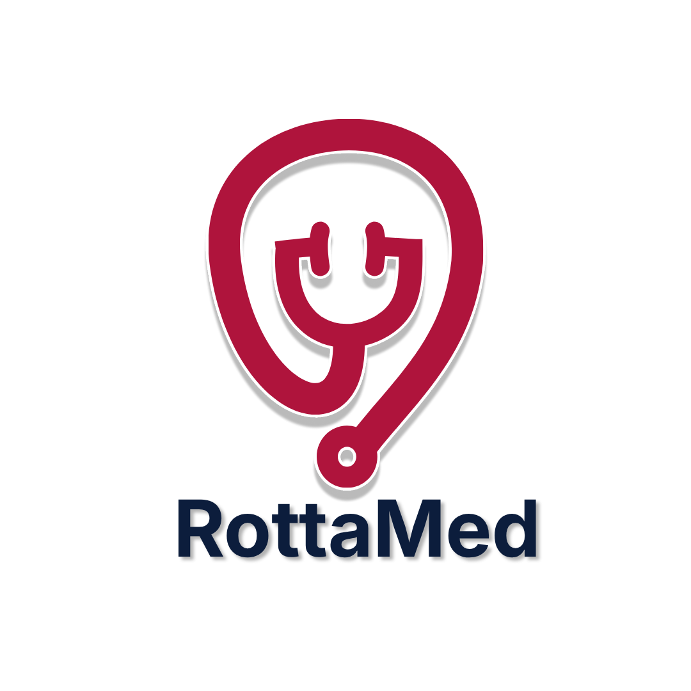

#  | RottaMed
Esse repositório é um projeto para a disciplina Fundamentos de Programação, que tem como objetivo criar estruturas de código como CRUD's e algumas funcionalidades baseadas no RottaMed (outro projeto).

## 👥 | Integrantes do grupo
* Everton Luan Gomes Batista - everton.luan@ufrpe.br / elgb@cesar.school
* Ricardo Freire de Sousa Neto - rfsn@cesar.school / ric_fneto@live.com
* Rayane Maria de Pontes Gomes - rmpg@cesar.school
* Letícia de Carvalho Minucelli - lcm4@cesar.school
